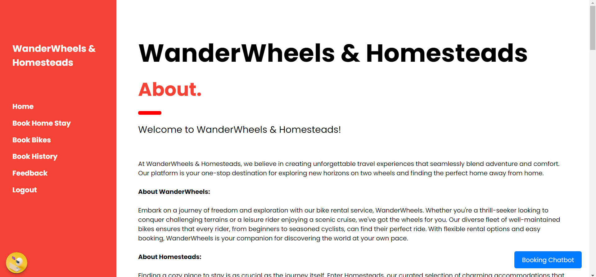
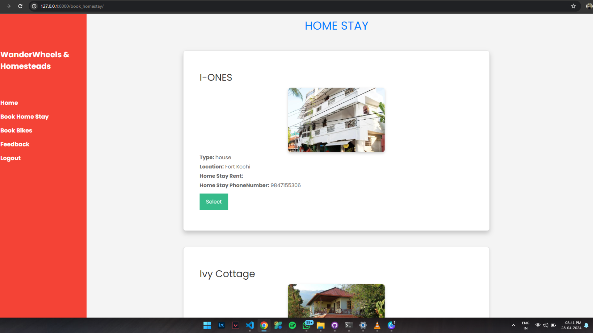
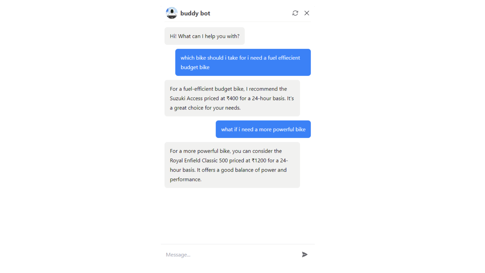
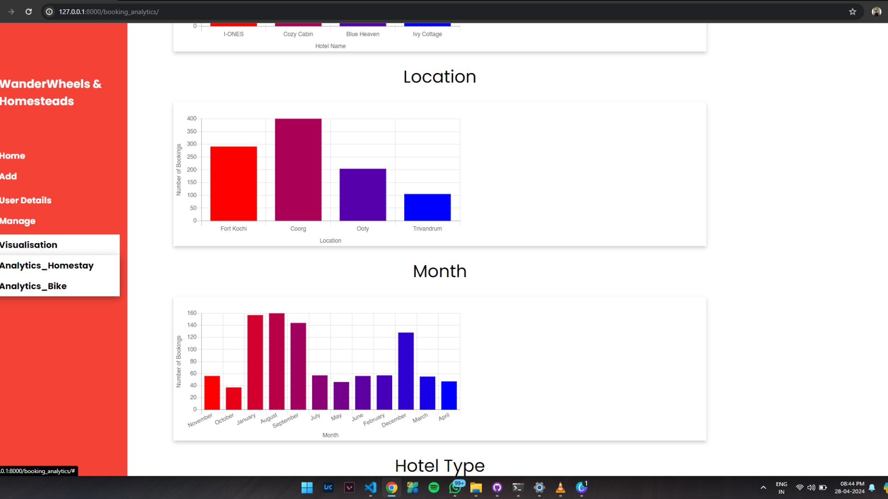
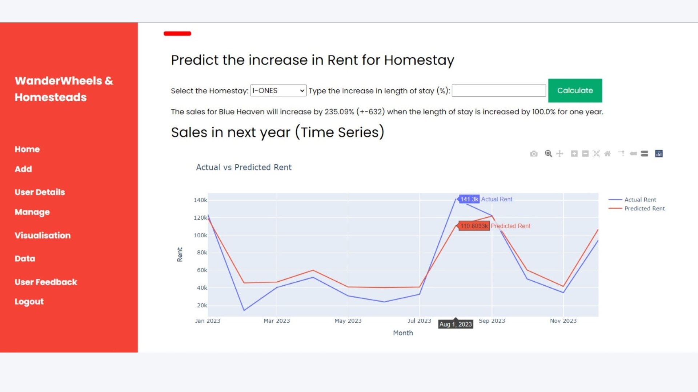

# Rental Booking System
## Overview

This project is a Rental Booking System developed from January 2024 to April 2024, designed for managing homestay and bike rentals.

### Key Features
- **Website Development**: Built with Django for homestay and bike rentals.
- **AI Chatbot Integration**: Used Chatbase API to assist users with queries.
- **Context-aware, Intent-based Chatbot**: Direct booking for rooms and bikes.
- **Database Management**: SQLite3 for models, tables, and queries.
- **Predictive Analysis**: Time series analysis to forecast rental trends with Python (pandas, NumPy) and TensorFlow/Keras.

## Synopsis

[Watch Synopsis](showcase/video.mp4)

## Screenshots

### Homepage

### Booking Page

### Chatbot Interaction

### Data Analytics

## Technologies Used

- **Python**
- **Django**
- **HTML**
- **SQLite**
- **Chatbase API**
- **TensorFlow/Keras**
- **Pandas, NumPy**

## Project Details

- **Duration**: January 2024 – April 2024
- **Roles**: Full Stack Development, AI Integration, Data Analysis
